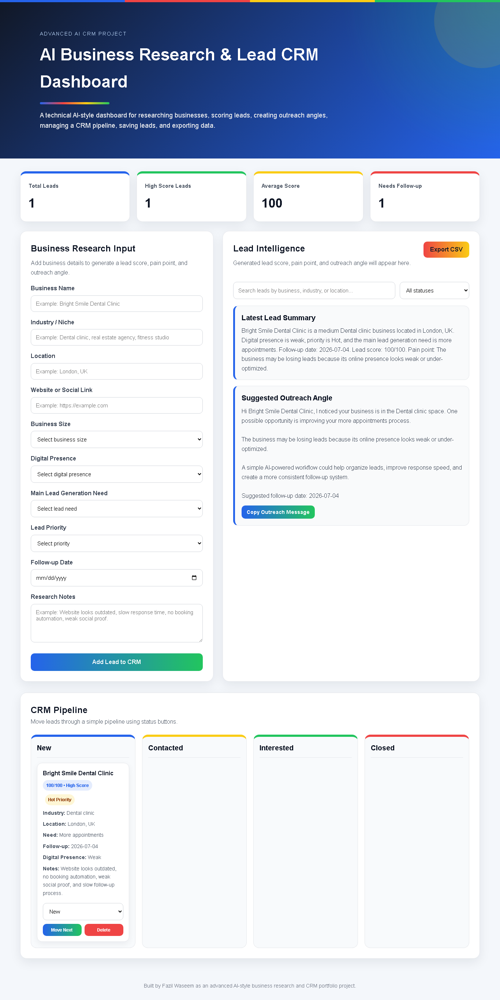

# AI Business Research & Lead CRM Dashboard

A technical AI-style business research and lead CRM dashboard with lead scoring, kanban pipeline, outreach angles, saved leads, search/filter, localStorage, and CSV export.

## Live Demo

https://fazilprojects.github.io/ai-business-research-crm-dashboard/

## Screenshot

## Project Overview

This project was built as part of my AI automation, lead generation, and business research portfolio. The goal was to create a more advanced technical dashboard that helps research businesses, score leads, generate outreach angles, and manage leads through a simple CRM pipeline.

This project is designed for an AI lead generation workflow where a user can add business research details, generate a lead score, understand the possible pain point, and move the lead through different pipeline stages.

The dashboard includes:

* Business research input form
* Lead scoring system
* Lead intelligence summary
* Suggested outreach angle
* CRM kanban pipeline
* Lead status management
* Search and filter system
* localStorage saved leads
* CSV export

## Inputs

The dashboard takes these inputs:

* Business name
* Industry / niche
* Location
* Website or social link
* Business size
* Digital presence
* Main lead generation need
* Research notes

## Outputs

Based on the inputs, the dashboard generates:

* Lead score
* Latest lead summary
* Suggested outreach angle
* CRM lead card
* Pipeline status
* Dashboard statistics
* Exportable CSV data

## Features

* Clean and responsive advanced dashboard layout
* Business research form
* Lead scoring logic
* AI-style pain point analysis
* Outreach angle generator
* CRM pipeline with kanban columns
* Lead status movement
* Search and filter functionality
* Saved leads using localStorage
* CSV export feature
* Dashboard statistics
* Personal brand color system using blue, red, yellow, and green
* Live deployment using GitHub Pages

## Tech Stack

* HTML
* CSS
* JavaScript
* localStorage
* CSV export logic
* GitHub Pages

## Example Use Case

An AI lead generation agency can use this dashboard to research a business, identify its possible lead generation problems, score the lead, and manage outreach through a simple CRM pipeline.

Example input:

* Business name: Bright Smile Dental Clinic
* Industry / niche: Dental clinic
* Location: London, UK
* Website: https://brightsmileexample.com
* Business size: Medium
* Digital presence: Weak
* Main lead generation need: More appointments
* Research notes: Website looks outdated, no booking automation, weak social proof, and slow follow-up process.

The dashboard then generates a lead score, business research summary, outreach angle, and adds the lead to the CRM pipeline.

## What I Learned

Through this project, I practiced:

* Building a more advanced frontend dashboard
* Creating a CRM-style user interface
* Writing JavaScript logic with arrays and objects
* Using localStorage to save lead data
* Creating lead scoring logic
* Building search and filter functionality
* Creating kanban-style lead pipeline columns
* Moving leads between CRM statuses
* Creating CSV export functionality
* Structuring a technical portfolio project
* Deploying a live dashboard using GitHub Pages
* Documenting a project professionally for a portfolio

## Future Improvements

* Add drag-and-drop kanban movement
* Add editable lead cards
* Add lead priority labels
* Add follow-up date reminders
* Add copy-to-clipboard outreach messages
* Add notes history for each lead
* Add dashboard charts
* Add AI API integration in the future
* Add import CSV functionality
* Add authentication in a full-stack version

## Author

Built by Fazil Waseem as an advanced AI-style business research and CRM portfolio project.
